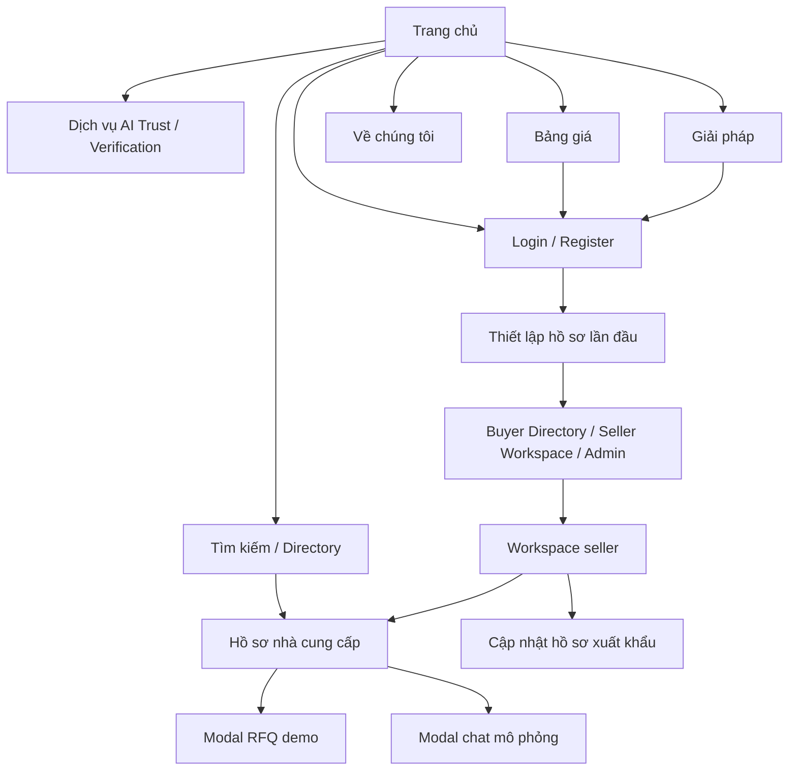

# VYBE Trade — Tài liệu source frontend dành cho AI code UI

> Phân tích ngày 29/09/2026 từ `src/`, `package.json`, cấu hình Vite/TypeScript và `index.html`.
> Tài liệu mô tả code hiện có và hướng dẫn tiếp tục phát triển UI. Chưa chạy ứng dụng hoặc kiểm chứng giao diện trên trình duyệt. Hai file `.docx` trong `docs/` không được dùng làm nguồn yêu cầu cho bản phân tích này.
> Cập nhật auth demo: login/register; Company Onboarding 4 bước cho Buyer/Seller, một lần theo user; Admin bỏ qua onboarding. Seller tái sử dụng wizard có sẵn, Buyer dùng wizard mới cùng phong cách. Xem `docs/AUTH_DEMO.md`. Kiểm tra trình duyệt trực tiếp chưa khả dụng.

## 1. Frontend này dùng để làm gì?

VYBE Trade là giao diện nền tảng B2B giúp **buyer quốc tế tìm và đánh giá nhà cung cấp Việt Nam**, đồng thời giúp **seller Việt Nam xây dựng hồ sơ xuất khẩu và thể hiện mức độ tin cậy**. Ngành hàng trong dữ liệu mẫu chủ yếu là nông sản, thủy sản, thực phẩm: cà phê, gạo, hạt điều, hồ tiêu, trái cây.

Điểm trọng tâm của sản phẩm là **hồ sơ doanh nghiệp + sản phẩm + giấy phép/chứng nhận + cấp độ xác minh**, sau đó mới đến kết nối thương mại qua RFQ và chat.

Source hiện tại là **SPA demo tương tác bằng dữ liệu mẫu**, chưa phải hệ thống giao dịch hoàn chỉnh:

- Có tìm kiếm cục bộ, chuyển màn hình/tab, nhập form, thêm/sửa/xóa một số dữ liệu trong bộ nhớ, mở modal và hiển thị thông báo.
- Không thấy API nghiệp vụ, backend, cơ sở dữ liệu, đăng nhập thật, thanh toán thật hay xử lý AI/OCR thật trong source.
- Các thông báo “đã xác thực OCR”, “đã gửi thành công”, hạn mức Escrow và chỉ số hiệu quả là nội dung demo; không phải bằng chứng tích hợp dịch vụ.
- Đây không phải luồng bán lẻ có giỏ hàng/checkout. UI hiện ưu tiên hồ sơ năng lực, MOQ, công suất, chứng nhận và yêu cầu báo giá B2B.

## 2. Người dùng và thuật ngữ

| Đối tượng/thuật ngữ | Ý nghĩa trong UI |
| --- | --- |
| Buyer | Nhà nhập khẩu/phân phối/người mua quốc tế tìm nguồn cung, xem hồ sơ, gửi RFQ, chat |
| Seller | Doanh nghiệp Việt Nam khai báo công ty, sản phẩm, thị trường xuất khẩu, giấy phép và chứng nhận |
| Partner | Tổ chức chứng nhận, hiệp hội, logistics, tài chính; được giới thiệu tại Solutions/About, chưa có workspace riêng |
| RFQ | Request for Quotation: yêu cầu báo giá theo sản phẩm, khối lượng, Incoterms, điểm đến và yêu cầu kỹ thuật |
| MOQ | Số lượng đặt hàng tối thiểu; hiện thường là chuỗi kèm đơn vị |
| PUC / PHC | Mã vùng trồng / mã cơ sở đóng gói theo nội dung UI |
| Trust Badge | Huy hiệu cấp độ xác minh L0–L3 |
| Risk Score | Chỉ số rủi ro trong demo AI Trust; khác với cấp độ xác minh doanh nghiệp |
| Evidence Record | Khái niệm lưu bằng chứng xác minh trong nội dung demo; chưa có kho bằng chứng thật |
| Escrow | Khái niệm bảo lãnh/thanh toán được nhắc trong hồ sơ và nội dung giới thiệu; chưa có luồng giao dịch thật |

## 3. Stack và cấu trúc

| Thành phần | Thực tế trong repo |
| --- | --- |
| Framework | React 19 + TypeScript, entry `src/main.tsx` |
| Build/dev | Vite 8, plugin React |
| Styling | Tailwind CSS 4 qua `@tailwindcss/vite`; phần lớn class viết trực tiếp trong JSX |
| Icon | `lucide-react`; logo, cờ và nhiều minh họa dùng SVG inline |
| State | `useState` tại từng màn hình; Context dùng cho ngôn ngữ |
| Auth demo | `src/lib/demoAuth.ts`; tài khoản, phiên và cờ onboarding lưu localStorage; kiểm soát role ở UI |
| Điều hướng | State `currentPage` trong `App.tsx`; không có React Router |
| Dữ liệu | Object/array hardcode bên trong component; chưa có tầng API/store nghiệp vụ |
| Font | Plus Jakarta Sans, Inter, tải từ Google Fonts trong `index.html` |
| Ảnh | URL Unsplash bên ngoài; ảnh sản phẩm do người dùng chọn chỉ preview cục bộ ở onboarding |
| Dependency chưa thấy sử dụng trong `src/` | `@google/genai`, `express`, `dotenv`, `motion`, `framer-motion` |
| Alias | `@/*` trỏ về **gốc repo**, không phải `src/` |

```text
src/
  main.tsx                         # StrictMode → LanguageProvider → App
  App.tsx                          # Chuyển màn hình, header công khai, trang chủ
  index.css                        # Tailwind import và style nền/font toàn cục
  context/LanguageContext.tsx       # vi/en/fr/ja, dictionary, lưu lựa chọn ngôn ngữ
  components/
    AuthPage.tsx                   # Login/register, chọn Buyer/Seller, hiển thị 3 tài khoản mẫu
    BuyerOnboarding.tsx            # Wizard company Buyer 4 bước cho người mua quốc tế
    AdminDashboard.tsx             # Tổng quan tài khoản demo cục bộ
    BuyerDirectory.tsx             # Danh sách nhà cung cấp, DIRECTORY_SUPPLIERS
    BuyerSellerDetail.tsx          # Hồ sơ công khai, SupplierData, DEFAULT_SELLER_DETAIL
    LiveSearchDropdown.tsx         # Autocomplete, SEARCH_PRODUCTS, helper tìm kiếm
    SellerOnboarding.tsx           # Wizard hồ sơ seller 4 bước
    SellerWorkspace.tsx            # Không gian quản lý seller 7 tab
    ProductVerification.tsx        # Trang giới thiệu dịch vụ xác minh
    ProductAiTrust.tsx             # Trang giới thiệu AI Trust Co-pilot
    PricingPlans.tsx               # Gói Free/Member/Premium và modal đăng ký
    SolutionsPage.tsx              # Bộ giải pháp theo đối tượng, simulator demo
    AboutUsPage.tsx                # Giới thiệu nền tảng và form liên hệ
    CountryFlag.tsx                # Cờ SVG cho các ngôn ngữ hiện có
    LanguageSelectorModal.tsx      # Modal chọn ngôn ngữ
```

Không có bộ component UI chung như Button, Input, Dialog hoặc hệ thống design tokens riêng. Khi sửa UI, đọc pattern tại màn hình gần nhất trước khi tạo thêm component/thư viện.

## 4. Bản đồ màn hình và điều hướng

Các giá trị dưới đây là **state**, không phải URL route. Reload khôi phục phiên demo và vào onboarding hoặc trang theo role; guest về `home`. Nút Back/Forward của trình duyệt chưa quản lý lịch sử chuyển màn hình.

| `currentPage` | Component | Mục đích |
| --- | --- | --- |
| `home` | JSX trong `App.tsx` | Landing, tìm nguồn cung, doanh nghiệp nổi bật |
| `buyer-directory` | `BuyerDirectory` | Tìm kiếm và so sánh nhà cung cấp |
| `buyer-seller-detail` | `BuyerSellerDetail` | Xem hồ sơ công khai của `selectedSupplier` |
| `login` / `register` | `AuthPage` | Đăng nhập demo / tạo tài khoản Buyer hoặc Seller |
| `onboarding` | `BuyerOnboarding` / `SellerOnboarding` | Company Onboarding 4 bước theo role; Admin không tham gia |
| `seller-profile` | `SellerOnboarding` | Wizard cập nhật hồ sơ xuất khẩu, có thể mở lại |
| `admin` | `AdminDashboard` | Tổng quan tài khoản demo cục bộ dành cho admin |
| `workspace` | `SellerWorkspace` | Quản lý hồ sơ, chứng nhận, tiến trình và cơ hội B2B |
| `product` | `ProductAiTrust` / `ProductVerification` | Giới thiệu hai dịch vụ; `productService` chọn nội dung |
| `pricing` | `PricingPlans` | Bảng gói dịch vụ và form đăng ký |
| `solutions` | `SolutionsPage` | Giới thiệu sáu nhóm giải pháp |
| `about` | `AboutUsPage` | Sứ mệnh, tầm nhìn, đối tượng phục vụ, liên hệ |



`renderTopHeader()` trong `App.tsx` phục vụ các màn hình công khai. Onboarding và workspace có header riêng. Menu “Nhà cung cấp” và “Buyer” cùng mở directory. Menu “Sản phẩm” mở **trang dịch vụ** AI Trust/Verification, không phải catalog sản phẩm độc lập.

`App` giữ `selectedSupplier` và `workspaceTab`. Component con nhận callback `onNavigate...` để yêu cầu chuyển trang; nên nối UI mới qua flow này nếu chưa có yêu cầu thay kiến trúc điều hướng.

Header dùng `directoryNav` để phân biệt mục “Doanh nghiệp” và “Buyer”: cả hai vẫn mở directory nhưng chỉ mục vừa chọn có `aria-current="page"` và gạch chân. Mặc định là “Doanh nghiệp”; chuyển sang detail rồi quay lại directory giữ lựa chọn này.

## 5. Chức năng từng màn hình

### 5.1. Trang chủ — `App.tsx`

- Header: logo VYBE TRADE, menu công khai, chọn ngôn ngữ, menu doanh nghiệp/tài khoản mẫu.
- Hero: thông điệp kết nối doanh nghiệp Việt Nam với thế giới, minh họa logistics/thương mại bằng SVG.
- Tìm kiếm: ô nhập, autocomplete, dropdown ngành hàng/thị trường/trust level và từ khóa phổ biến.
- Enter hoặc nút tìm kiếm chuyển directory, truyền `searchTerm` qua `initialSearchTerm`.
- Chọn supplier trong autocomplete mở hồ sơ tương ứng. Chọn sản phẩm tìm supplier theo `supplierId`, fallback về hồ sơ mặc định; chưa mở trang sản phẩm riêng.
- Bốn thẻ giá trị: doanh nghiệp xác minh, sản phẩm đa dạng, kết nối nhanh, hỗ trợ AI.
- Bốn doanh nghiệp nổi bật từ array `SUPPLIERS` riêng: VietFarm, Mekong Seafood, GreenFields Export, An Phu Food.
- Click doanh nghiệp nổi bật mở modal tóm tắt. Nút RFQ trong modal này hiện chỉ đóng modal. “Xem tất cả” mở modal thông báo chung.

Các dropdown ngành hàng/thị trường/trust lọc autocomplete và được truyền sang directory. Kết quả sản phẩm mở hồ sơ supplier qua ID dùng chung; CTA RFQ từ directory/thẻ nổi bật mở đúng hồ sơ và form RFQ.

### 5.2. Directory — `BuyerDirectory.tsx`

- Dữ liệu `DIRECTORY_SUPPLIERS` tại `src/lib/suppliers.ts` có 8 hồ sơ mẫu, gồm nông sản, thủy sản và thực phẩm chế biến.
- Layout có sidebar bộ lọc và vùng kết quả, ô tìm kiếm, từ khóa nhanh, số lượng kết quả, chế độ list/grid.
- Tìm kiếm lọc theo tên, tên giao dịch, vị trí, mô tả, tag, tên/danh mục sản phẩm; hỗ trợ không dấu và nội dung dịch Anh/Pháp/Nhật qua helper `src/lib/supplierSearch.ts`.
- Radio cấp độ xác minh thực sự lọc theo `badgeLevel`.
- Card hiển thị trust badge, địa điểm, sản phẩm/chứng nhận, công suất và CTA xem hồ sơ/gửi RFQ.
- Dropdown sort có state `sortBy` nhưng chưa có `.sort()` áp dụng cho kết quả.
- Nhiều checkbox sidebar và ô tìm danh mục chưa nối vào logic lọc. Nút “Thêm bộ lọc” hiện xóa các bộ lọc đang áp dụng. Một số số lượng ngành hàng/cấp độ vẫn hardcode.
- Nút “Gửi RFQ” gọi `onOpenRfqModal(supplier.name)`, nhưng callback trong `App` bỏ qua tên, chọn `DEFAULT_SELLER_DETAIL` rồi mở trang detail; **chưa tự mở modal RFQ và có thể chuyển sai supplier**.

### 5.3. Hồ sơ nhà cung cấp — `BuyerSellerDetail.tsx`

- Nhận `supplier: SupplierData`; dùng hồ sơ mặc định nếu không được truyền.
- Header hồ sơ: ảnh bìa/logo, tên, MST, vị trí, badge, năng lực, đánh giá và thông tin liên hệ.
- Năm tab: `overview`, `products`, `factory`, `certificates`, `reviews`.
- Tab sản phẩm có ảnh, MOQ, công suất, đóng gói, khoảng giá, thông số kỹ thuật và CTA hỏi giá.
- Chứng nhận có metadata và modal preview; preview được dựng bằng JSX, chưa phải đọc PDF gốc.
- Lưu doanh nghiệp chỉ toggle `isSaved`, chưa lưu backend/localStorage.
- RFQ: sản phẩm, số lượng/đơn vị, Incoterms, cảng đến, ngày dự kiến nhận, ghi chú. Submit chỉ mở modal `success`.
- Chat: thêm message vào state, phản hồi seller bằng nội dung cố định sau timer khoảng 1,2 giây; không phải realtime/AI.

### 5.4. Cập nhật hồ sơ seller — `SellerOnboarding.tsx`

Wizard được tái sử dụng ở page `onboarding` cho Seller đăng nhập lần đầu (bắt đầu bước 1, có callback `onComplete` để lưu hồ sơ). Nó cũng phục vụ page `seller-profile` để cập nhật hồ sơ, mở từ workspace sau khi hoàn tất onboarding.

Wizard 4 bước: lần onboarding đầu mở **bước 1**; mode cập nhật hồ sơ mặc định mở bước 2.

1. Thông tin công ty: tên, MST, loại hình, năm thành lập, địa chỉ, website, email.
2. Sản phẩm và năng lực: danh sách sản phẩm, ảnh, ngành hàng, thị trường xuất khẩu, bao bì, MOQ, công suất, mô tả, đánh dấu chủ lực.
3. Giấy phép/chứng nhận: ĐKKD, chứng chỉ tiêu chuẩn, giấy phép xuất khẩu, mã PUC/PHC và cam kết.
4. Xem lại hồ sơ, sửa từng phần, lưu/hoàn tất và modal thành công.

Tương tác thật trong bộ nhớ:

- Thêm/sửa/xóa sản phẩm; không cho xóa sản phẩm cuối cùng.
- Chọn ảnh tạo `URL.createObjectURL(file)` để preview; chưa upload server.
- Thêm/bỏ thị trường, thêm chứng nhận từ preset hoặc form, xóa chứng nhận.
- Đánh dấu chủ lực là toggle từng sản phẩm; chưa có quy tắc chỉ một sản phẩm chủ lực.
- Có thể click trực tiếp step để chuyển bước; chưa phải wizard kiểm tra chặt điều kiện từng bước.
- Modal thành công cho chuyển workspace tab `profile` hoặc `verification`.

**Giới hạn:** upload/đối soát giấy phép phần lớn là mô phỏng. Hoàn tất onboarding lần đầu lưu snapshot vào hồ sơ user; thông tin công ty được dùng tại workspace, nhưng sản phẩm/chứng nhận hiển thị workspace vẫn dùng nguồn mock riêng. Chỉnh sửa wizard ở mode `seller-profile` chưa đồng bộ lâu dài.

### 5.4a. Company Onboarding Buyer — `BuyerOnboarding.tsx`

1. Thông tin công ty: tên, quốc gia, khu vực, quy mô nhân sự, loại hình, website, người liên hệ/email/điện thoại.
2. Nhu cầu tìm nguồn hàng: ngành hàng, thông số sản phẩm, khối lượng/đơn vị, tần suất, thị trường/cảng đến, Incoterms, ngân sách.
3. Tiêu chí xác minh: cấp độ tối thiểu L1/L2/L3, nhiều chứng nhận, yêu cầu nhà máy/truy xuất, ghi chú.
4. Xem lại đủ thông tin, quay về sửa từng bước, xác nhận và hoàn tất.

Các bước chưa đi qua bị khóa để tránh bỏ qua form bắt buộc. Native form validation áp dụng khi tiếp tục; `completeOnboarding()` kiểm tra hồ sơ cuối cùng trước khi lưu. Buyer sau hoàn tất vào directory. Admin đăng nhập thẳng quản trị, không có wizard này.

### 5.5. Workspace seller — `SellerWorkspace.tsx`

Mặc định tab `profile`, cấp độ `currentLevel = 'L2'`.

| Tab | Nội dung và mức độ hoạt động |
| --- | --- |
| `profile` | Hồ sơ công ty, năng lực, sản phẩm, chứng chỉ; modal sửa cập nhật state ngay khi nhập; preview công khai |
| `licenses` | Danh sách chứng nhận; tìm kiếm và lọc nhóm; thêm/sửa/xóa bằng modal, toast; xác nhận trước khi xóa |
| `verification` | Timeline/cấp độ L0–L3, yêu cầu nâng cấp, modal evidence; L1/L2 đổi state cục bộ, L3 hiển thị bước đăng ký thẩm định |
| `overview` | Chỉ số lượt xem, RFQ, phản hồi và cấp độ từ dữ liệu mẫu |
| `products` | Danh sách sản phẩm mẫu; CTA mở onboarding; chưa có CRUD sản phẩm độc lập ở tab này |
| `rfq` | Danh sách RFQ mẫu; nút phản hồi chưa có handler nghiệp vụ |
| `notifications` | Thông báo mẫu về chứng chỉ và buyer |

Chứng nhận chia nhóm `legal`, `food_safety`, `agriculture`, `other`. Chọn file trong form thêm chứng nhận chỉ lấy tên/kích thước vào metadata; status OCR hợp lệ được gán cứng khi thêm.

`companyProfile`, `certificatesList`, `productsList` là dữ liệu riêng với onboarding và hồ sơ buyer. Callback mở hồ sơ công khai chưa chuyển dữ liệu vừa sửa, nên không được coi là đã publish hoặc đồng bộ.

### 5.6. Dịch vụ Verification — `ProductVerification.tsx`

- Trang giới thiệu quy trình xác minh và bốn cấp độ L0–L3; có minh họa bậc thang SVG.
- Modal bắt đầu: nhập công ty/MST → màn mô phỏng kiểm tra → xác nhận tiếp nhận.
- Modal quy trình, bảng so sánh cấp độ, chi tiết từng mức.
- Tất cả là flow demo; không gọi cổng doanh nghiệp, OCR hoặc gửi hồ sơ thực tế.

| Cấp độ | Ý nghĩa theo nội dung source |
| --- | --- |
| L0 — Unverified | Tự khai báo, chưa đối chiếu |
| L1 — Basic Verified | Kiểm tra pháp nhân/MST |
| L2 — Enhanced Verified | Đối chiếu chứng nhận chất lượng và năng lực |
| L3 — VYBE Certified | Thẩm tra sâu/thực địa; nội dung giới thiệu thêm tài chính, bảo chứng |

Đây là mô hình trình bày trong UI, chưa có máy trạng thái xác minh hay kiểm soát quyền phía backend.

### 5.7. AI Trust Co-pilot — `ProductAiTrust.tsx`

- Giới thiệu trợ lý tiền kiểm hồ sơ, Risk Score, cảnh báo và báo cáo.
- Bốn bước: upload tài liệu → OCR/LLM phân tích → đối chiếu đa nguồn → Risk Score/báo cáo.
- Demo dùng timer chuyển 4 bước, hoàn tất sau khoảng 2,1 giây; kết quả mẫu, không có model inference.
- Có modal demo, giới thiệu, quy trình và chi tiết bước; switch sang Verification bằng callback.

### 5.8. Bảng giá — `PricingPlans.tsx`

- Gói Free, Member, Premium; giá mẫu đang ghi Member 990.000 VNĐ/tháng, Premium 2.990.000 VNĐ/tháng.
- Toggle `monthly`/`annual` đổi giá, đơn vị kỳ thanh toán và tổng tiền trong modal. Helper `src/lib/pricing.ts` giữ giá năm bằng 10 tháng: Member 9.900.000, Premium 29.900.000 VNĐ/năm (~17% tiết kiệm); định dạng số theo ngôn ngữ chọn.
- Có bảng so sánh, FAQ accordion, modal đăng ký gói và màn thành công.
- Form gồm công ty, MST, người liên hệ, điện thoại, email, phương thức thanh toán, ghi chú.
- Submit chỉ đổi `registrationSuccess`; chưa tạo tài khoản, hóa đơn hay thanh toán. Có CTA tiếp tục onboarding/workspace.

### 5.9. Giải pháp — `SolutionsPage.tsx`

Lọc card theo `all`, `seller`, `buyer`, `partner`; sáu nhóm:

1. `verification-engine` — xác minh pháp lý/năng lực.
2. `ai-trust` — trợ lý phân tích tín nhiệm.
3. `matching` — đối sánh buyer/supplier.
4. `trust-profile` — hồ sơ tín nhiệm.
5. `rfq-workflow` — quy trình báo giá/thương mại.
6. `market-intel` — thông tin thị trường xuất khẩu.

Modal chi tiết có simulator bằng timer và kết quả text cố định. Form đặt demo/tư vấn chỉ đổi state thành công. Các chỉ số như độ chính xác, tăng tỷ lệ chốt deal và dữ liệu thị trường là nội dung giới thiệu mẫu.

### 5.10. Về chúng tôi — `AboutUsPage.tsx`

Hero, sứ mệnh/tầm nhìn/giá trị, đối tượng phục vụ, nội dung xây dựng niềm tin và CTA. Form liên hệ gồm người liên hệ, tổ chức, email, điện thoại, chủ đề, nội dung; submit chỉ hiển thị thành công cục bộ.

## 6. Nguồn dữ liệu và component tái sử dụng

| Nguồn | Dùng ở đâu | Lưu ý |
| --- | --- | --- |
| `SupplierData` / `DEFAULT_SELLER_DETAIL` | Detail, directory, App, autocomplete | Type hồ sơ công khai; `badgeLevel` hiện chỉ L1/L2/L3 |
| `DIRECTORY_SUPPLIERS` | Directory, autocomplete, chọn supplier theo sản phẩm | 8 hồ sơ mẫu tại `src/lib/suppliers.ts` |
| `SEARCH_PRODUCTS` / `SearchProductItem` | Autocomplete | Sinh trực tiếp từ các sản phẩm của supplier; ID ghép supplier/product |
| `SUPPLIERS` trong `App` | Thẻ nổi bật ở trang chủ | Cấu trúc rút gọn; ID cùng nguồn directory để mở đúng hồ sơ/RFQ |
| `ExportProductItem` | Onboarding | `exportMarkets`, `supplyCapacity`, `description`; khác schema sản phẩm công khai |
| `WorkspaceCertificateItem` | Workspace | Có category, ngày cấp/hết hạn, status, file metadata |
| `companyProfile` / `productsList` / `certificatesList` | Workspace | State độc lập, chưa có liên kết danh tính với supplier đang xem |

`SupplierData` gồm định danh/MST, thương hiệu, badge, ảnh, địa chỉ, năng lực, phản hồi, đánh giá, thị trường, mô tả/tag, PUC/PHC và các mảng `products`, `certificates`, `factoryPhotos`, `reviews`.

Các giá trị MOQ/công suất/giá/ngày trong mock thường là **chuỗi để hiển thị**, không phải số/ngày đã chuẩn hóa. Không tự dùng chúng để tính tiền, sắp xếp số học hoặc kiểm tra chứng nhận hết hạn mà chưa xác định quy tắc parse.

`LiveSearchDropdown` nhận `query`, `isOpen`, `onClose`, `onSelectSupplier`, `onSelectProduct`, `onSelectKeyword`, `onViewAllResults`. Tái sử dụng component này và helper `matchSearch`/`removeVietnameseTones` cho tìm kiếm cùng kiểu. Dropdown giới hạn tối đa 4 supplier, 4 sản phẩm, 5 keyword; tổng hiển thị là tổng sau giới hạn. “Tìm kiếm gần đây” là state mẫu, không lưu lâu dài.

`BuyerDirectory` và `LiveSearchDropdown` cùng import dữ liệu tại `src/lib/suppliers.ts`; không còn import lẫn nhau. Helper tìm kiếm/bộ lọc nằm ở `src/lib/supplierSearch.ts`.

## 7. Ngôn ngữ

- `LanguageProvider` bọc toàn bộ ứng dụng; `useLanguage()` trả `language`, `setLanguage`, `currentLanguageOption`, `t`, `tr`.
- Hỗ trợ thực tế: `vi`, `en`, `fr`, `ja`; mặc định tiếng Việt, lưu lựa chọn ở `localStorage['vybe_language']`.
- Dictionary gồm nhóm `nav`, `header`, `hero`, `directory`, `features`, `featured`, `modal`, `common`.
- Các trang công khai, login/register, buyer/seller onboarding, workspace và admin dùng `tr(text)` tại điểm hiển thị. Catalog `src/i18n/catalog.json` chứa hơn 1.500 chuỗi Anh/Pháp/Nhật, tiếng Việt giữ làm nguồn. Bản dịch máy được tạo trước build; ứng dụng không gọi dịch vụ dịch khi chạy. Chỉnh nội dung/cách diễn đạt trực tiếp trong catalog.
- Chuỗi động dùng placeholder `{0}`, `{1}`; phải giữ đủ placeholder ở ba bản dịch. Thêm chuỗi UI mới cần bổ sung catalog và gọi `tr()`; thiếu entry sẽ hiển thị nguyên bản.
- Giá trị form, enum, role/ID và tên tài khoản/doanh nghiệp không đổi khi dịch. Native `option` phải có `value` canonical riêng; dịch nhãn hiển thị để tránh làm sai filter/onboarding. `LanguageSelect` dùng ở các header riêng.
- Nội dung Solutions có nhắc hồ sơ Anh–Việt–Trung–Nhật, nhưng code hiện **không có tiếng Trung**.
- `CountryFlag` dùng SVG. `LanguageSelectorModal` dùng chung Context; cần giữ các mã ngôn ngữ đồng bộ.
- `index.html` mặc định `lang="vi"`; Context tự cập nhật `html.lang` và tiêu đề theo lựa chọn.

## 8. Quy ước thiết kế cần giữ khi code UI

Các giá trị sau được suy ra từ class/style source, chưa phải hệ thống token chính thức:

| Thành phần | Pattern hiện có |
| --- | --- |
| Nền trang | `#f8fafc`, slate rất nhạt |
| Chữ chính | `#0f172a`, `text-slate-900`; phụ `text-slate-500/600` |
| Thương hiệu | Teal/emerald; logo `#0b5e52`, CTA seller thường `#083832`, hover `#062924` |
| CTA phụ/link | Blue 600/700; CTA trang chủ có slate đậm |
| Badge | L0 slate, L1 blue, L2 emerald, L3 thường amber/gold; thẻ nổi bật trang chủ có biến thể L3 teal |
| Card | Nền trắng, `border-slate-100/200`, `rounded-2xl/3xl`, shadow nhẹ |
| Button/input | Chủ yếu `rounded-xl/2xl`; pill/filter dùng `rounded-full` |
| Khoảng cách | `gap-3/4/5/6`, card `p-4/5/6`; khung công khai `max-w-7xl mx-auto px-5 sm:px-8 lg:px-10` |
| Typography | Nội dung 12–14px, nhãn nhỏ 10–11px; hero 30px lên khoảng 42–46px, đậm |
| Icon | Lucide 14–24px tùy ngữ cảnh, đi cùng text hoặc badge |
| Modal | `fixed inset-0 z-50`, backdrop đen mờ/blur, panel trắng bo tròn; form dài có vùng scroll |
| Feedback | Hover màu/viền/shadow, trạng thái selected, toast, thông báo thành công |

Responsive dùng breakpoint Tailwind `sm`, `md`, `lg`, `xl`, grid/flex chuyển cột. Workspace sidebar `hidden md:flex`, rộng `w-64 xl:w-72`; menu công khai `hidden lg:flex`. Chưa thấy menu mobile đầy đủ thay thế các vùng bị ẩn; sửa responsive cần kiểm tra khả năng tiếp cận màn hình/tab, không chỉ tránh tràn chiều ngang.

Các class `animate-in`, `fade-in`, `zoom-in-95` xuất hiện trong source nhưng chưa thấy plugin định nghĩa chúng trong dependency/config. Không mặc định coi các hiệu ứng này chạy; CSS transition có sẵn có thể đủ cho thay đổi đơn giản.

**Hướng dẫn cho UI mới:** giữ giao diện sáng, rõ thông tin doanh nghiệp, phân cấp tốt giữa nội dung thương mại và trạng thái xác minh. Tái sử dụng pattern hiện có; không tự đổi sang dark theme, thư viện UI khác hoặc thiết kế bán lẻ nếu chưa có yêu cầu.

**Accessibility cần bổ sung khi chạm vào vùng liên quan:** button có tên truy cập, label gắn đúng input, focus bàn phím rõ, card clickable dùng phần tử tương tác phù hợp, dialog có semantics và quản lý focus/Escape. Đây là yêu cầu khi phát triển tiếp, không phải khẳng định source hiện đã có đầy đủ.

## 9. Các khoảng trống AI cần biết trước khi sửa

1. **Có auth demo, chưa có auth backend.** Header hiển thị user đăng nhập; logout xóa phiên và về login. UI giới hạn workspace seller và trang admin theo role; không phải bảo mật phía server.
2. **Không có URL route.** Không hứa deep link, share URL profile hoặc lịch sử Back/Forward trước khi bổ sung routing.
3. **Dữ liệu không đồng bộ.** Onboarding, workspace, directory và featured cards dùng nguồn mẫu riêng; rời component có thể mất state chỉnh sửa.
4. **Persistence cục bộ gồm ngôn ngữ và auth demo.** Tài khoản, phiên, snapshot Company Onboarding/cờ hoàn tất/version được lưu theo trình duyệt. Hồ sơ form ngắn cũ được nâng lên wizard mới một lần. RFQ/chat và các chỉnh sửa wizard seller tại page `seller-profile` vẫn là state mẫu độc lập.
5. **Một số filter/sort chỉ có UI.** Ghi rõ khi nối logic, và kiểm tra cả số lượng kết quả lẫn danh sách.
6. **Nút RFQ directory đang sai flow.** Cần giữ supplier được chọn và truyền ý định mở RFQ nếu task yêu cầu sửa tính năng này.
7. **Ảnh/file preview chưa là upload.** Không suy ra có storage hay link PDF thật từ tên file/metadata.
8. **AI/OCR/xác minh/Escrow/thanh toán là demo.** `.env.example` và metadata có nhắc Gemini nhưng không có lời gọi Gemini trong `src/`; README là hướng dẫn AI Studio chung.
9. **Form còn dùng dữ liệu điền sẵn và ngày mẫu 2024–2027.** Không coi số liệu, giá, ngày, trạng thái chứng nhận hay lời quảng bá là dữ liệu hiện hành đã xác thực.
10. **Edit profile workspace cập nhật ngay lúc nhập.** Đóng modal không tự rollback; nút lưu chỉ đóng modal. Nếu cần hành vi Save/Cancel thật, phải thêm draft trong phạm vi tính năng.
11. **Mobile/accessibility cần kiểm tra thực tế.** Ẩn sidebar/menu và click trên `div` có thể làm luồng không tiếp cận được.

Các điểm trên là kết quả đọc source; tài liệu này không tự sửa hành vi của ứng dụng.

## 10. Hướng dẫn giao việc cho AI code UI

Đọc tài liệu này rồi đọc **component đích và callback liên quan trong `App.tsx`** trước khi thay đổi. Dùng code làm nguồn sự thật khi tài liệu và source lệch nhau.

| Cần sửa | Bắt đầu đọc |
| --- | --- |
| Trang chủ, header, menu công khai, chuyển trang | `src/App.tsx` |
| Login/register, phiên, role, onboarding một lần | `src/lib/demoAuth.ts`, `src/components/AuthPage.tsx`, `src/components/BuyerOnboarding.tsx`, `src/components/SellerOnboarding.tsx` |
| Search/autocomplete và match không dấu | `src/components/LiveSearchDropdown.tsx`, caller tại App/Directory |
| Danh sách/filter/sort nhà cung cấp | `src/components/BuyerDirectory.tsx` |
| Hồ sơ công khai, sản phẩm, RFQ, chat | `src/components/BuyerSellerDetail.tsx`, callback directory tại App |
| Wizard, khai báo sản phẩm, ảnh, thị trường | `src/components/SellerOnboarding.tsx` |
| Hồ sơ seller/chứng nhận/xác minh | `src/components/SellerWorkspace.tsx` |
| Giới thiệu dịch vụ | `src/components/ProductVerification.tsx`, `src/components/ProductAiTrust.tsx` |
| Gói dịch vụ | `src/components/PricingPlans.tsx` |
| Giải pháp/giới thiệu | `src/components/SolutionsPage.tsx`, `src/components/AboutUsPage.tsx` |
| Dịch và cờ/ngôn ngữ | `src/context/LanguageContext.tsx`, `CountryFlag.tsx`, `LanguageSelectorModal.tsx` |
| Font/nền/style toàn cục | `src/index.css`, `index.html` |

Nguyên tắc thực hiện:

- Giữ React + TypeScript + Tailwind + Lucide; ưu tiên component/helper đã có và HTML native.
- Thay đổi tại nơi sở hữu state/hành vi; tìm mọi caller trước khi đổi props/helper dùng chung.
- Sửa UI không đồng nghĩa phải tạo backend, store toàn cục hay thay router. Chỉ mở rộng những phần này khi nhiệm vụ yêu cầu.
- Giữ các enum page/tab/level nhất quán, nối CTA vào callback thực tế; không tạo thêm nút chỉ mở thông báo chung nếu nhiệm vụ yêu cầu flow hoạt động.
- Khi dùng mock mới, ghi rõ là dữ liệu demo; không biến success cục bộ thành tuyên bố giao dịch/xác minh thật.
- Đối với tính năng nối API sau này, trạng thái loading/error/empty/success phải dựa trên kết quả thực tế; không dùng timer giả để xác nhận tác vụ nghiệp vụ.
- Không đưa Gemini API key hoặc secret vào bundle frontend. Repo chưa có endpoint/backend để thay timer bằng AI thật.
- Đọc lại nguồn sau mỗi thay đổi và cập nhật phần tương ứng của tài liệu nếu flow thực sự thay đổi.

Prompt mẫu có thể đưa cho AI:

```text
Đọc docs/FE_UI_GUIDE.md, sau đó đọc component và callback liên quan trong source.
Nhiệm vụ: [mô tả màn hình/thay đổi cụ thể].
Giữ phong cách sáng teal/slate, React + TypeScript + Tailwind + Lucide hiện có.
Tái sử dụng component/helper, bảo toàn điều hướng và dữ liệu supplier được chọn.
Phân biệt dữ liệu demo với xử lý thật, bảo đảm responsive và truy cập bàn phím.
Chỉ sửa phạm vi cần thiết; báo rõ kiểm tra đã chạy và phần chưa kiểm chứng.
```

## 11. Chạy và kiểm tra khi sửa code

```bash
npm install
npm run dev       # Vite, port 5173, host 0.0.0.0
npm run lint      # tsc --noEmit; đây là kiểm tra TypeScript, không phải ESLint
npm run build    # vite build
npm run preview  # xem build
```

Repo có `bun.lock` và `package-lock.json`. `npm test` chạy kiểm tra auth bằng Node assert + tsx, không thêm test framework. Chọn package manager nhất quán khi cài dependency. Script `clean` dùng `rm -rf`, không phù hợp chạy trực tiếp trong PowerShell mặc định.

Checklist sau khi sửa UI ở phạm vi liên quan:

- [ ] Từ home tìm keyword có dấu/không dấu → directory có kết quả đúng hoặc empty state rõ.
- [ ] Chọn đúng supplier → detail hiển thị đúng doanh nghiệp; sản phẩm tìm thấy vẫn giữ đúng supplier.
- [ ] Filter level/list-grid/sort hoạt động theo những gì nhiệm vụ đã yêu cầu.
- [ ] RFQ mở đúng supplier/sản phẩm, form không mất dữ liệu ngoài ý muốn, success phản ánh đúng demo/API.
- [ ] Onboarding mở đúng bước mặc định, thêm/sửa/xóa sản phẩm và thị trường, không xóa hết sản phẩm.
- [ ] Workspace đổi đủ các tab; thêm/sửa/xóa chứng nhận và toast; preview/public flow được kiểm tra.
- [ ] Đổi ngôn ngữ lưu qua reload; các vùng sửa có nội dung dịch tương ứng nếu task yêu cầu.
- [ ] Mobile/tablet/desktop không tràn ngang và vẫn vào được các màn hình/tab cần thiết.
- [ ] Modal có thể đóng và thao tác bằng bàn phím; focus/label/tên button rõ.
- [ ] `npm run lint` và `npm run build` đạt nếu có thay đổi code.

**Kiểm chứng của bản tài liệu này:** phân tích tĩnh source và cấu hình; không cài dependency, không chạy build/typecheck, không kiểm tra browser. Không có thay đổi logic hoặc giao diện ứng dụng.

### Kiểm tra hồi quy header

Chạy `npm run dev`, mở trang ở kích thước desktop với ngôn ngữ tiếng Việt, rồi dán đoạn sau vào DevTools Console. Kiểm tra chuyển qua lại hai mục và rời directory; đoạn này thao tác trên dữ liệu demo, kết thúc tại trang chủ.

```js
const headerNav = () => document.querySelector('header nav');
const clickHeader = async (label) => {
  const button = [...headerNav().querySelectorAll('button')]
    .find((item) => item.textContent.trim() === label);
  if (!button) throw new Error(`Không tìm thấy menu: ${label}`);
  button.click();
  await new Promise((resolve) => setTimeout(resolve, 100));
};
for (const label of ['Doanh nghiệp', 'Buyer', 'Doanh nghiệp', 'Buyer', 'Giá']) {
  await clickHeader(label);
  const active = [...headerNav().querySelectorAll('[aria-current="page"]')];
  if (active.length !== 1 || active[0].textContent.trim() !== label) {
    throw new Error(`Header active sai sau khi bấm ${label}`);
  }
}
document.querySelector('header .group.select-none').click();
await new Promise((resolve) => setTimeout(resolve, 100));
if (headerNav().querySelector('[aria-current="page"]')) {
  throw new Error('Header còn active khi về trang chủ');
}
console.log('Header navigation: PASS');
```
